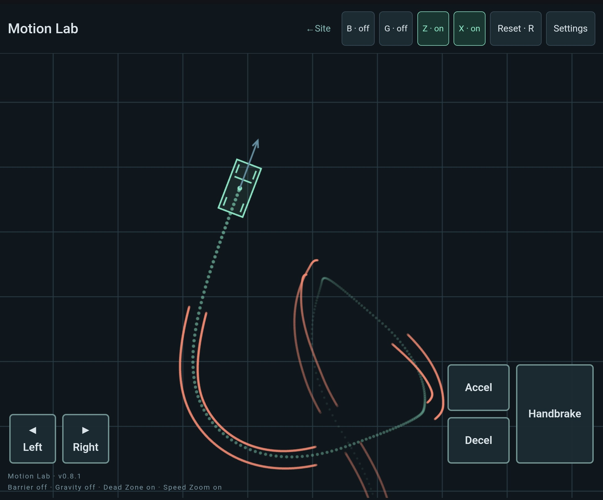

# motion-lab
A 30th anniversary JavaScript recreation of the original 2D physics simulation
which later became the basis of the vehicle system in the original "Grand Theft Auto",
by DMA Design programmer Patrick Kerr.

